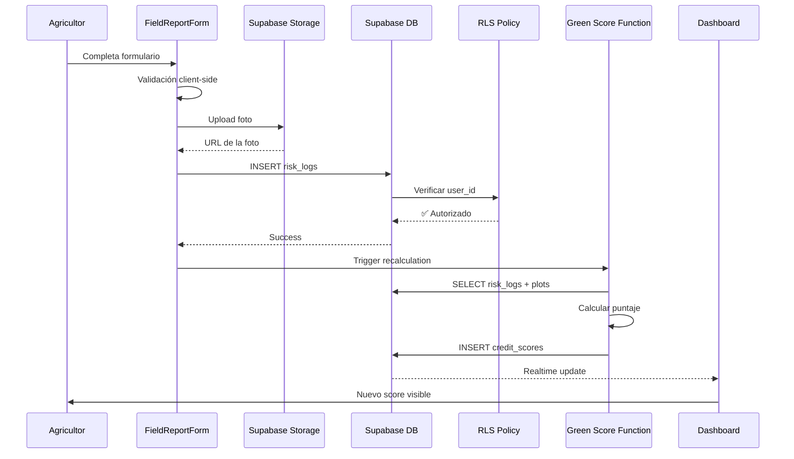
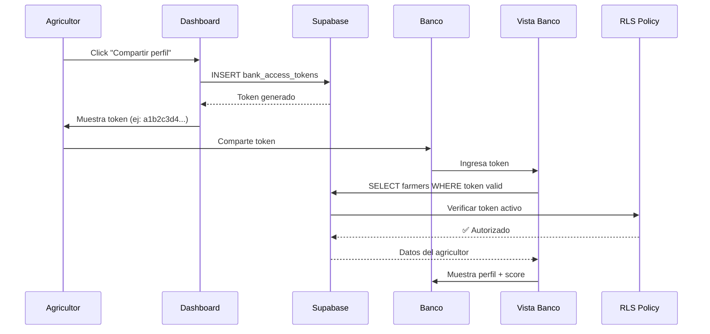

# 🏗️ Arquitectura Técnica - AgroCredit MVP

## Índice
1. [Visión General](#visión-general)
2. [Arquitectura de Componentes](#arquitectura-de-componentes)
3. [Flujo de Datos](#flujo-de-datos)
4. [Seguridad y Privacidad](#seguridad-y-privacidad)
5. [Performance y Escalabilidad](#performance-y-escalabilidad)
6. [Decisiones de Diseño](#decisiones-de-diseño)

---

## Visión General

AgroCredit sigue una arquitectura **serverless** basada en:
- **Frontend**: Next.js 16 con App Router (SSR + CSR híbrido)
- **Backend**: Supabase (PostgreSQL + Edge Functions)
- **Storage**: Supabase Storage para fotos
- **Auth**: Supabase Auth (JWT-based)

```
┌─────────────────────────────────────────────────┐
│                   FRONTEND                       │
│  Next.js 16 + React 19 + TypeScript + Tailwind  │
│                                                  │
│  ┌──────────┐  ┌──────────┐  ┌──────────┐      │
│  │Dashboard │  │ Reportes │  │  Banco   │      │
│  └────┬─────┘  └────┬─────┘  └────┬─────┘      │
│       │             │             │             │
└───────┼─────────────┼─────────────┼─────────────┘
        │             │             │
        └─────────────┴─────────────┘
                      │
        ┌─────────────▼─────────────┐
        │    Supabase Client JS     │
        │  (realtime + RLS + auth)  │
        └─────────────┬─────────────┘
                      │
        ┌─────────────▼─────────────┐
        │      SUPABASE BACKEND      │
        │                            │
        │  ┌────────────────────┐   │
        │  │   PostgreSQL DB    │   │
        │  │   + Row Level      │   │
        │  │   Security (RLS)   │   │
        │  └────────────────────┘   │
        │                            │
        │  ┌────────────────────┐   │
        │  │  Edge Functions    │   │
        │  │  (Green Score)     │   │
        │  └────────────────────┘   │
        │                            │
        │  ┌────────────────────┐   │
        │  │  Storage Buckets   │   │
        │  │  (Fotos evidencia) │   │
        │  └────────────────────┘   │
        └────────────────────────────┘
```

---

## Arquitectura de Componentes

### Frontend Layer

#### 1. App Router (Next.js 16)
```
app/
├── layout.tsx           # Root layout con metadata mobile
├── page.tsx             # Dashboard (SSR + Hydration)
├── reporte/
│   └── page.tsx         # Client Component (interactivo)
└── banco/
    └── page.tsx         # Public route (token-gated)
```

**Estrategia de Rendering:**
- **Dashboard**: Server-Side Rendering (SSR) para SEO y FCP rápido
- **Formularios**: Client-Side Rendering (CSR) para interactividad
- **Vista Banco**: Hybrid (SSR para layout, CSR para data sensible)

#### 2. Components Layer
```
components/
├── credit-meter.tsx          # Presentational (Pure React)
├── field-report-form.tsx     # Controlled Component (State)
└── risk-card.tsx             # Presentational
```

**Principios:**
- **Single Responsibility**: Cada componente hace una cosa
- **Props drilling limitado**: Max 2 niveles de profundidad
- **TypeScript strict**: Props interfaces obligatorias
- **Mobile-first**: `min-w-[320px]` como base

#### 3. Lib Layer (Business Logic)
```
lib/
├── supabase.ts           # Cliente singleton + Types
├── green-score.ts        # Algoritmo de scoring
└── utils.ts              # Helpers generales
```

**Separación de Concerns:**
- **No lógica de negocio en componentes**
- **Funciones puras cuando es posible**
- **Side effects aislados en hooks custom**

---

## Flujo de Datos

### 1. Registro de Reporte de Campo



### 2. Acceso Bancario



---

## Seguridad y Privacidad

### Row Level Security (RLS)

#### Farmers Table
```sql
-- Los agricultores solo ven sus propios datos
CREATE POLICY "Users can view own farmer profile"
  ON farmers FOR SELECT
  USING (auth.uid() = user_id);

-- Los bancos pueden ver datos si tienen token válido
CREATE POLICY "Banks can view farmer data with valid token"
  ON farmers FOR SELECT
  USING (
    id IN (
      SELECT farmer_id FROM bank_access_tokens 
      WHERE is_active = TRUE 
      AND expires_at > NOW()
    )
  );
```

#### Risk Logs Table
```sql
-- Solo el dueño puede insertar reportes
CREATE POLICY "Users can insert own risk logs"
  ON risk_logs FOR INSERT
  WITH CHECK (
    farmer_id IN (
      SELECT id FROM farmers WHERE user_id = auth.uid()
    )
  );
```

### Tokens de Acceso Bancario

```typescript
interface BankAccessToken {
  id: string;
  farmer_id: string;
  token: string;           // SHA-256 hash
  expires_at: timestamp;   // Default: 30 días
  is_active: boolean;      // Revocable por el agricultor
  access_count: number;    // Auditoría de accesos
}
```

**Características:**
- ✅ Tokens únicos generados con `gen_random_bytes(32)`
- ✅ Expiración automática (30 días default)
- ✅ Revocables por el agricultor en cualquier momento
- ✅ Log de accesos (cuántas veces el banco consultó)
- ✅ No exponen datos sensibles (solo ID del farmer)

---

## Performance y Escalabilidad

### Database Indexes

```sql
-- Queries frecuentes optimizadas
CREATE INDEX idx_risk_logs_farmer_id ON risk_logs(farmer_id);
CREATE INDEX idx_risk_logs_logged_at ON risk_logs(logged_at DESC);
CREATE INDEX idx_credit_scores_farmer_id ON credit_scores(farmer_id);
CREATE INDEX idx_bank_tokens_token ON bank_access_tokens(token);
```

### Caching Strategy

#### Frontend
```typescript
// React Query / SWR para cache client-side
const { data: creditScore } = useSWR(
  `/api/credit-score/${farmerId}`,
  fetcher,
  { revalidateOnFocus: false, dedupingInterval: 60000 } // 1 min
);
```

#### Backend (Supabase)
```sql
-- Materialized view para scores agregados (próximamente)
CREATE MATERIALIZED VIEW farmer_stats AS
SELECT 
  farmer_id,
  COUNT(*) as total_reports,
  AVG(ndvi_index) as avg_ndvi,
  SUM(cost) as total_investment
FROM risk_logs
GROUP BY farmer_id;
```

### Estimación de Carga

**Proyección 1000 agricultores activos:**
- 100 reportes/día → 3000/mes
- Cálculo Green Score: ~200ms/request
- DB queries: ~50ms (con indexes)
- Total: **250ms end-to-end**

**Bottlenecks potenciales:**
1. Upload de fotos (depende de red móvil rural)
2. Cálculo NDVI real (si se integra Sentinel-2)

**Soluciones:**
- Image compression client-side (max 1MB)
- Background jobs para cálculos pesados (Edge Functions)
- CDN para assets estáticos (Vercel)

---

## Decisiones de Diseño

### ¿Por qué Next.js 16 sobre otros frameworks?

| Criterio | Next.js | Remix | Astro |
|----------|---------|-------|-------|
| SSR Nativo | ✅ | ✅ | ❌ |
| App Router | ✅ | ❌ | ❌ |
| Edge Runtime | ✅ | ✅ | ❌ |
| TypeScript DX | ⭐⭐⭐⭐⭐ | ⭐⭐⭐⭐ | ⭐⭐⭐ |
| Vercel Deploy | ⭐⭐⭐⭐⭐ | ⭐⭐⭐ | ⭐⭐⭐⭐ |
| Community | 🔥 Huge | 🔥 Growing | 🔥 Niche |

**Decisión:** Next.js por madurez, performance y deploy simplificado.

### ¿Por qué Supabase sobre Firebase o custom API?

| Criterio | Supabase | Firebase | Express + Postgres |
|----------|----------|----------|-------------------|
| PostgreSQL | ✅ | ❌ (NoSQL) | ✅ |
| RLS Nativo | ✅ | ❌ | ❌ (manual) |
| Real-time | ✅ | ✅ | ❌ (WebSockets manual) |
| Auth Built-in | ✅ | ✅ | ❌ (passport.js) |
| Dev Time | ⚡ Fast | ⚡ Fast | 🐌 Slow |
| Cost (1k users) | $25/mo | $30/mo | $50/mo (hosting) |

**Decisión:** Supabase por RLS nativo y SQL relacional (crítico para auditoría).

### ¿Por qué TypeScript estricto?

```typescript
// ❌ Sin TypeScript
function calculateScore(data) {
  return data.reports * 10; // ¿Qué es data? ¿Qué retorna?
}

// ✅ Con TypeScript
function calculateScore(params: GreenScoreParams): GreenScoreResult {
  return {
    score: params.preventionActionsCount * 10,
    riskLevel: params.score >= 70 ? 'bajo' : 'medio'
  };
}
```

**Beneficios:**
- Autocomplete inteligente (menos bugs)
- Refactoring seguro
- Documentación inline
- Detección de errores en compile-time

### Mobile-First CSS Strategy

```css
/* ❌ Desktop-first (malo para mobile) */
.container { width: 1200px; }
@media (max-width: 768px) { .container { width: 100%; } }

/* ✅ Mobile-first (mejor performance) */
.container { width: 100%; padding: 1rem; }
@media (min-width: 768px) { .container { max-width: 1200px; } }
```

**Ventajas:**
- Menos CSS enviado a móviles (mayoría de usuarios)
- Progressive enhancement natural
- Forzar simplificación de UI

---

## Roadmap Técnico

### Fase 1: MVP (Actual) ✅
- [x] Schema DB completo
- [x] Componentes UI core
- [x] Algoritmo Green Score
- [x] Vista agricultor + banco
- [x] Mock data para demo

### Fase 2: Producción (Q2 2024)
- [ ] Supabase Auth real (SMS para agricultores)
- [ ] Upload de fotos a Storage
- [ ] Geolocalización con GPS
- [ ] PWA con offline mode

### Fase 3: Escalabilidad (Q3 2024)
- [ ] Integración APIs clima (IDEAM)
- [ ] Cálculo NDVI via Sentinel-2
- [ ] Dashboard analytics para ONG
- [ ] Exportación PDF automatizada

### Fase 4: Expansión (Q4 2024)
- [ ] Multi-tenancy (diferentes bancos)
- [ ] API pública para integraciones
- [ ] Machine Learning para predicción de riesgo
- [ ] Blockchain para auditoría inmutable

---

## Testing Strategy

```bash
# Unit Tests (Vitest)
npm run test:unit

# E2E Tests (Playwright)
npm run test:e2e

# Type Checking
npm run type-check

# Linting
npm run lint
```

### Test Coverage Targets
- **Unit Tests**: 80%+ (lib/ y utils)
- **Integration Tests**: 60%+ (API calls)
- **E2E Tests**: Critical paths (login, reporte, score)

---

## Monitoring y Observabilidad

### Métricas Clave
```typescript
// Vercel Analytics
export const vitals = [
  'FCP', // First Contentful Paint < 1.8s
  'LCP', // Largest Contentful Paint < 2.5s
  'CLS', // Cumulative Layout Shift < 0.1
  'FID', // First Input Delay < 100ms
];

// Business Metrics
export const kpis = [
  'reportes_por_dia',
  'score_promedio_usuarios',
  'tasa_conversion_credito',
  'tiempo_promedio_decision_banco',
];
```

### Error Tracking
- **Sentry** para frontend errors
- **Supabase Logs** para backend errors
- **Slack webhooks** para alertas críticas

---

## Contribución de Código

### Estándares
```typescript
// ✅ Buen código
export async function fetchFarmerData(
  farmerId: string
): Promise<Farmer | null> {
  const { data, error } = await supabase
    .from('farmers')
    .select('*')
    .eq('id', farmerId)
    .single();
  
  if (error) {
    console.error('Error fetching farmer:', error);
    return null;
  }
  
  return data;
}

// ❌ Mal código (sin tipos, sin error handling)
export async function getFarmer(id) {
  const data = await supabase.from('farmers').select('*').eq('id', id);
  return data;
}
```

### Convenciones
- **Nombres de funciones**: verbos en inglés (`calculate`, `fetch`, `update`)
- **Nombres de variables UI**: español (`nombreCompleto`, `puntajeCredito`)
- **Commits**: Conventional Commits (`feat:`, `fix:`, `docs:`)

---

**Documento actualizado:** Enero 2024  
**Maintainer:** AgroCredit Core Team
